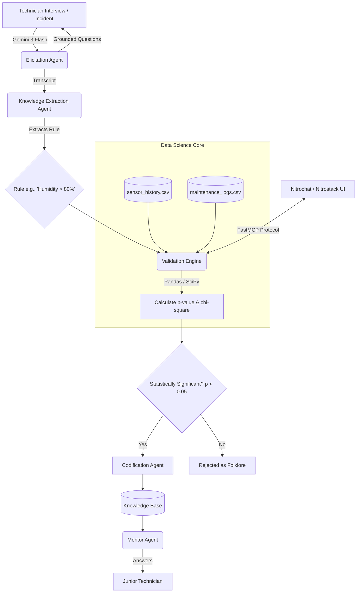

# CONTINUUM: Tacit Knowledge Capture & Transfer Network

Continuum captures tacit manufacturing knowledge from experienced technicians before they retire. Instead of simply recording interviews, its primary innovation is that every extracted heuristic is statistically validated against historical maintenance and sensor data before becoming operational knowledge.

The system distinguishes real operational knowledge from unsupported folklore.

## Architecture & Workflow



## Features
- **Statistical Validation**: Uses Pandas and SciPy to prove rules using Chi-square and p-values.
- **FastMCP Server**: Exposes the math validation engine to Nitrochat LLMs as an MCP Tool.
- **Gemini 3 Flash**: Used for intelligent interviewing and transcript extraction.
- **Langfuse Integration**: Traces and tracks all LLM generations for observability.

## How to run the MCP Server
```bash
# 1. Install dependencies
pip install -r requirements.txt

# 2. Run the MCP server
python continuum/mcp_server.py
```
Then connect Nitrochat to the running stdio process.
